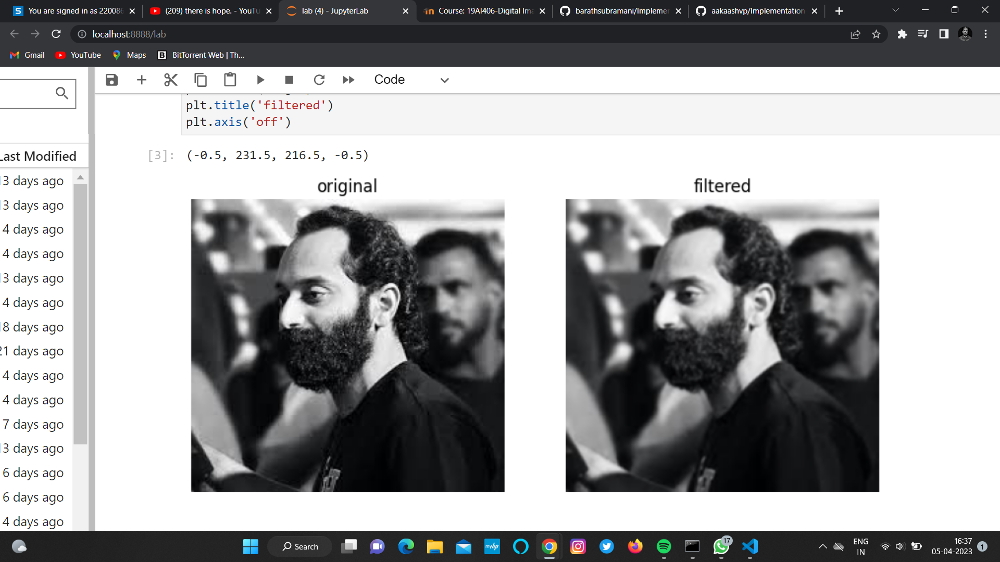
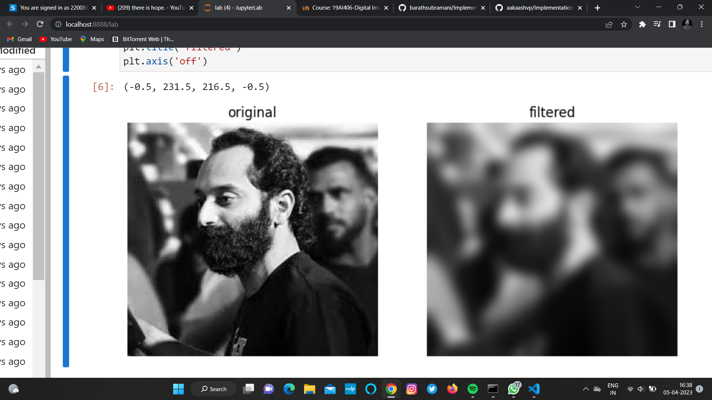
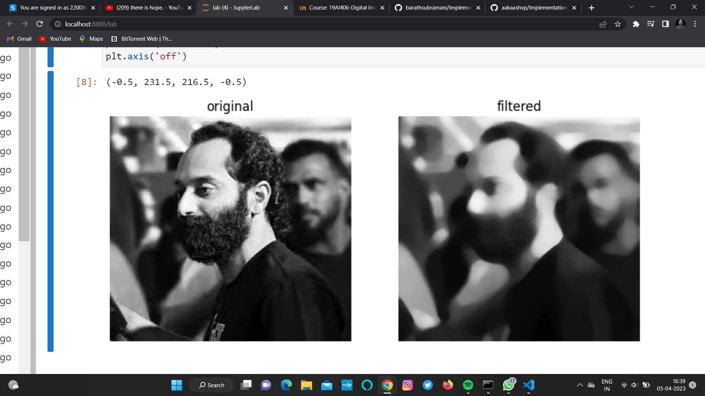
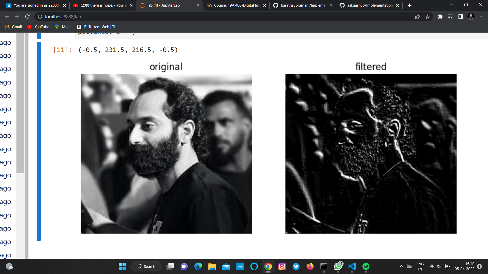
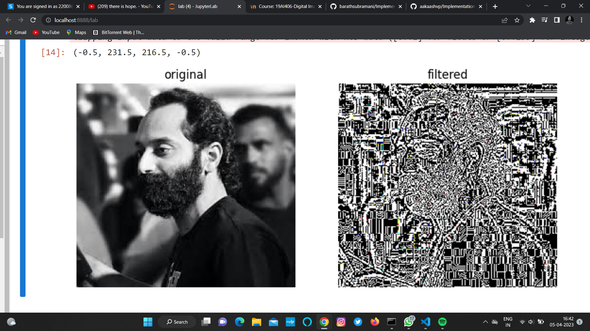

# Implementation-of-Filters
## Aim:
To implement filters for smoothing and sharpening the images in the spatial domain.

## Software Required:
Anaconda - Python 3.7

## Algorithm:
### Step1
Import the necessary modules 

### Step2
For performing smoothing operation on a image.

### Step3
For performing sharpening on a image.

### Step4
Display all the images with their respective filters.

## Program:
### Developed By   : Barath S
### Register Number: 212222230018
</br>

### 1. Smoothing Filters

i) Using Averaging Filter
```python
import cv2
import numpy as np
import matplotlib.pyplot as plt

image1 = cv2.imread('Pictures/dipt/images.jpeg')
image2 = cv2.cvtColor(image1,cv2.COLOR_BGR2RGB)
kernel = np.ones((11,11), np.float32)/121
kernel2 = np.array([[1,2,1],[2,4,2],[1,2,1]])/16
image3 = cv2.filter2D(image2,-1,kernel)

plt.figure(figsize = (9,9))
plt.subplot(1,2,1)
plt.imshow(image2)
plt.title('original')
plt.axis('off')

plt.subplot(1,2,2)
plt.imshow(image3)
plt.title('filtered')
plt.axis('off')
```

ii) Using Weighted Averaging Filter
```Python
import cv2
import numpy as np
import matplotlib.pyplot as plt

image1 = cv2.imread('Pictures/dipt/images.jpeg')
image2 = cv2.cvtColor(image1,cv2.COLOR_BGR2RGB)
kernel = np.ones((11,11), np.float32)/121
kernel2 = np.array([[1,2,1],[2,4,2],[1,2,1]])/16
kernel1=np.array([[1,2,1],[2,4,2],[1,2,1]])/16
image3=cv2.filter2D(image2,-1,kernel1)

plt.figure(figsize = (9,9))
plt.subplot(1,2,1)
plt.imshow(image2)
plt.title('original')
plt.axis('off')

plt.subplot(1,2,2)
plt.imshow(image3)
plt.title('filtered')
plt.axis('off')
```
iii) Using Gaussian Filter
```Python
import cv2
import numpy as np
import matplotlib.pyplot as plt

image1 = cv2.imread('Pictures/dipt/images.jpeg')
image2 = cv2.cvtColor(image1,cv2.COLOR_BGR2RGB)
kernel = np.ones((11,11), np.float32)/121
kernel2 = np.array([[1,2,1],[2,4,2],[1,2,1]])/16
gaussian_blur=cv2.GaussianBlur(image2,(33,33),0,0)

plt.figure(figsize = (9,9))
plt.subplot(1,2,1)
plt.imshow(image2)
plt.title('original')
plt.axis('off')

plt.subplot(1,2,2)
plt.imshow(gaussian_blur)
plt.title('filtered')
plt.axis('off')
```

iv) Using Median Filter
```Python
import cv2
import numpy as np
import matplotlib.pyplot as plt

image1 = cv2.imread('Pictures/dipt/images.jpeg')
image2 = cv2.cvtColor(image1,cv2.COLOR_BGR2RGB)
kernel = np.ones((11,11), np.float32)/121
kernel2 = np.array([[1,2,1],[2,4,2],[1,2,1]])/16
median=cv2.medianBlur(image2,13)

plt.figure(figsize = (9,9))
plt.subplot(1,2,1)
plt.imshow(image2)
plt.title('original')
plt.axis('off')

plt.subplot(1,2,2)
plt.imshow(median)
plt.title('filtered')
plt.axis('off')
```

### 2. Sharpening Filters
i) Using Laplacian Kernal
```Python
import cv2
import numpy as np
import matplotlib.pyplot as plt

image1 = cv2.imread('Pictures/dipt/images.jpeg')
image2 = cv2.cvtColor(image1,cv2.COLOR_BGR2RGB)
kernel = np.ones((11,11), np.float32)/121
kernel2=np.array([[-1,-1,-1],[2,-2,1],[2,1,-1]])
image3=cv2.filter2D(image2,-1,kernel2)

plt.figure(figsize = (9,9))
plt.subplot(1,2,1)
plt.imshow(image2)
plt.title('original')
plt.axis('off')

plt.subplot(1,2,2)
plt.imshow(image3)
plt.title('filtered')
plt.axis('off')
```
ii) Using Laplacian Operator
```Python
import cv2
import numpy as np
import matplotlib.pyplot as plt

image1 = cv2.imread('Pictures/dipt/images.jpeg')
image2 = cv2.cvtColor(image1,cv2.COLOR_BGR2RGB)
kernel = np.ones((11,11), np.float32)/121
kernel2=np.array([[-1,-1,-1],[2,-2,1],[2,1,-1]])
image3=cv2.filter2D(image2,-1,kernel2)
laplacian=cv2.Laplacian(image2,cv2.CV_64F)

plt.figure(figsize = (9,9))
plt.subplot(1,2,1)
plt.imshow(image2)
plt.title('original')
plt.axis('off')

plt.subplot(1,2,2)
plt.imshow(laplacian)
plt.title('filtered')
plt.axis('off')
```

## OUTPUT:
### 1. Smoothing Filters


i) Using Averaging Filter


ii) Using Weighted Averaging Filter


iii) Using Gaussian Filter


iv) Using Median Filter
<

### 2. Sharpening Filters


i) Using Laplacian Kernal


ii) Using Laplacian Operator


## Result:
Thus the filters are designed for smoothing and sharpening the images in the spatial domain.
